# Downloading Anaconda

Anaconda Individual Edition can be downloaded as a Linux 64 Bit .sh

[Anaconda](https://www.anaconda.com/products/individual)

The .sh can be installed on most Linux distros such as Ubuntu, Mint, POPOS!, Fedora and DeepIn Linux. 

# Anaconda Installation

In this example I will use Fedora 34.

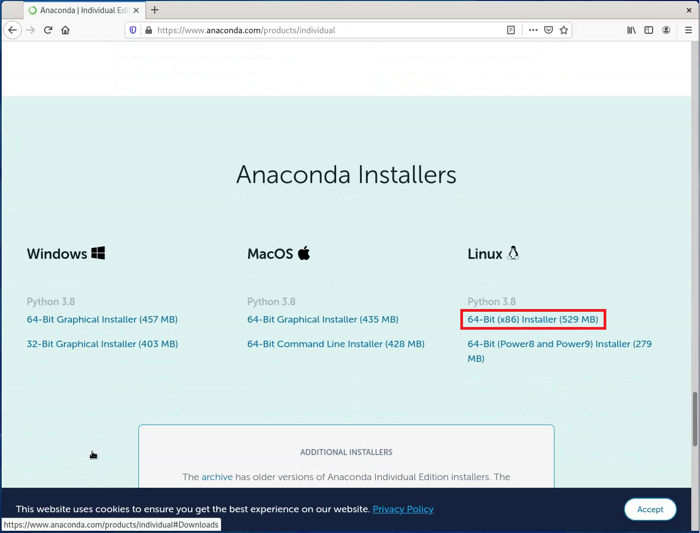

Wait for the Download to complete:

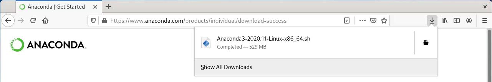

Then go to the Downloads folder:

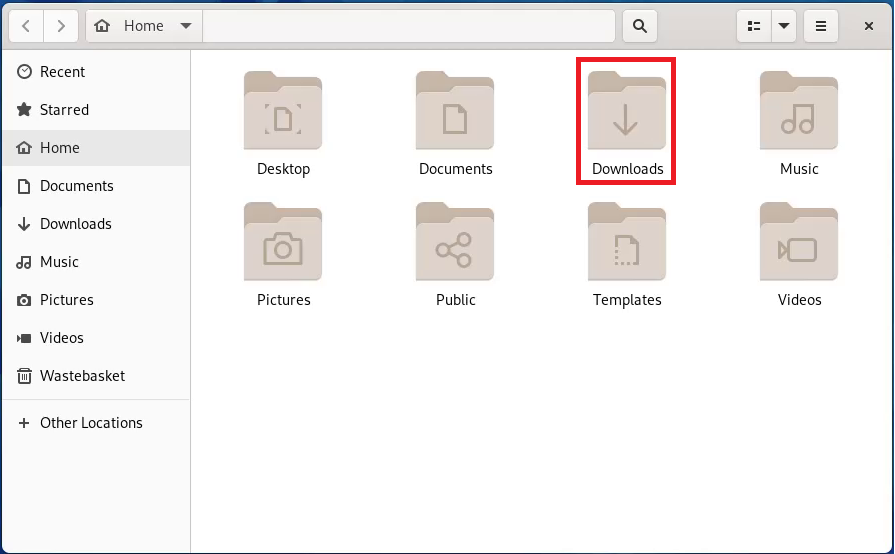

Write click some black space with the folder and select Open in Terminal:

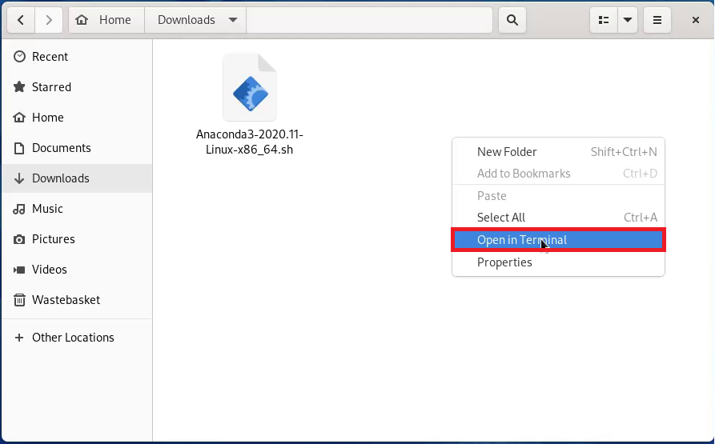

Right click the .sh file and select copy the file name including the extension.

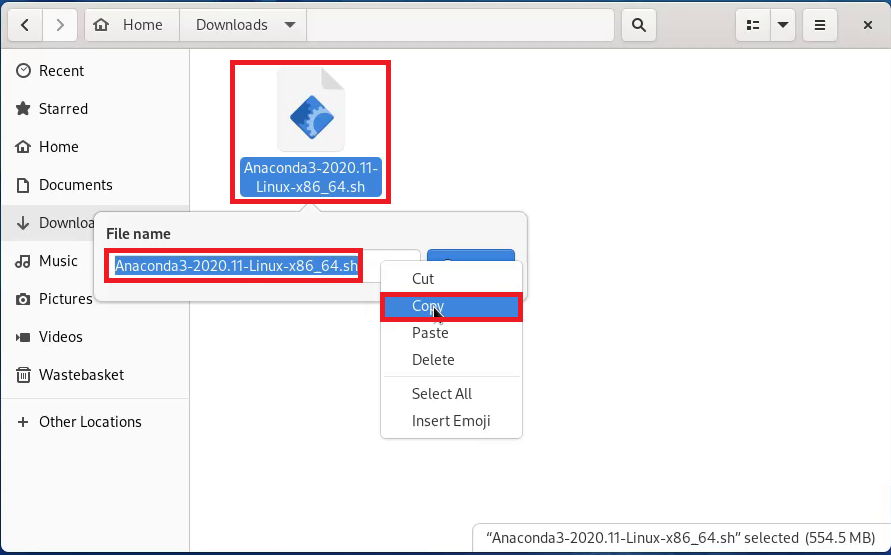

Type in the following:

```bash```

Then paste in the file name. 

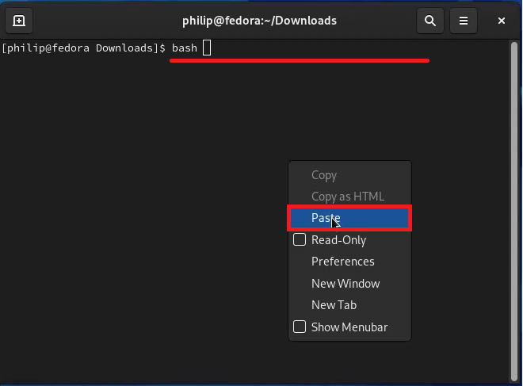

For example:

```bash Anaconda3-2020.11-Linux-x86_64.sh```

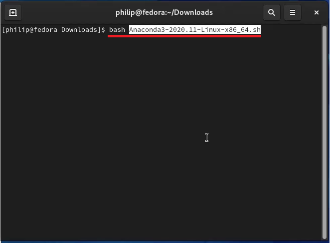

Hold down 

```↩``` 

to scroll quickly through the License Agreement:

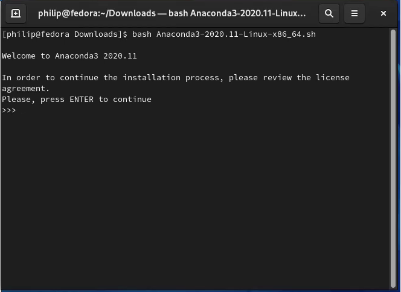

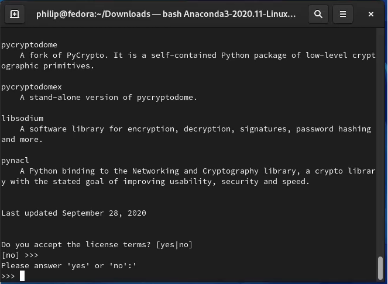

Type in:

```yes```

to accept the License Agreement.

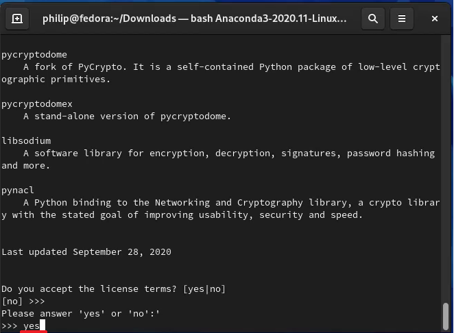

Type 

```↩``` 

to install in the default directory:

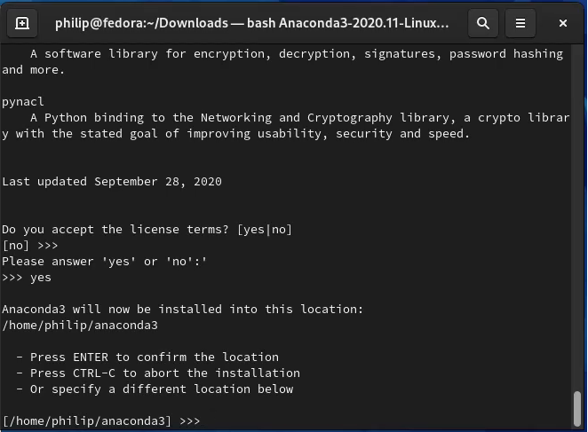

You will asked if you want to initialize Anaconda. You will need to do this to launch Anaconda from the terminal.

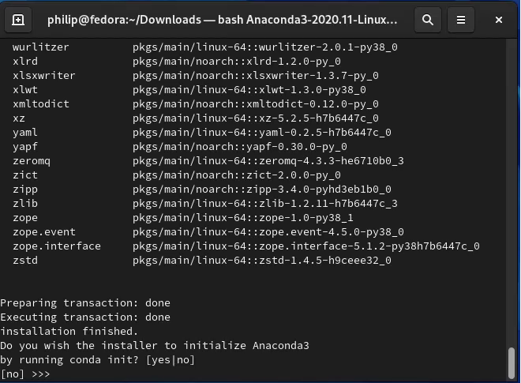

Type in 

```yes```

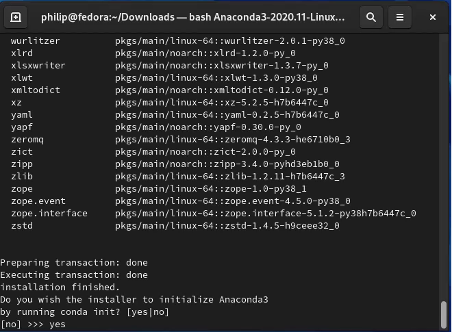

You will be informed Anaconda is now installed. Close the Terminal.

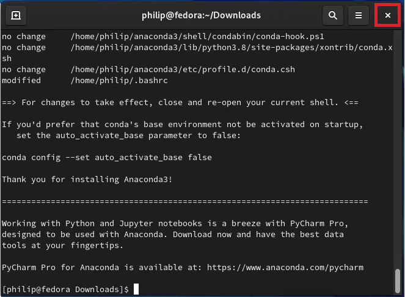

# Updating Anaconda and JupyterLab

Open up a new Terminal.

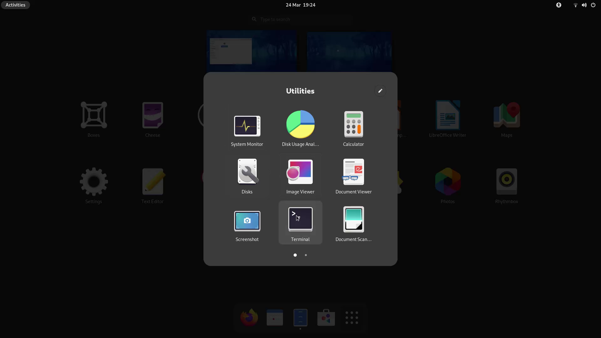

To update the Anaconda installation type in the following command:

```conda update anaconda```

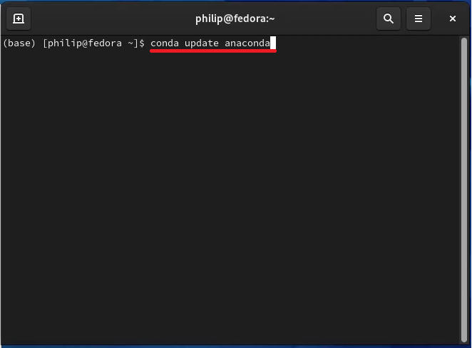

Details about the latest versions available will be listed. Type in

```y``` 

to update to the latest versions.

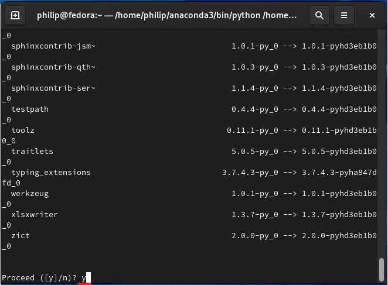

A new prompt will display when updated.

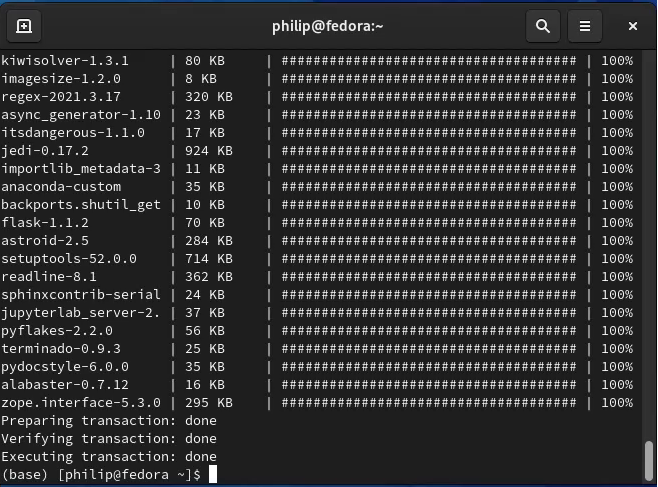

The latest version of JupyterLab is available on conda forge. To update type in the following command:

```conda install -c conda-forge jupyterlab=3``` 

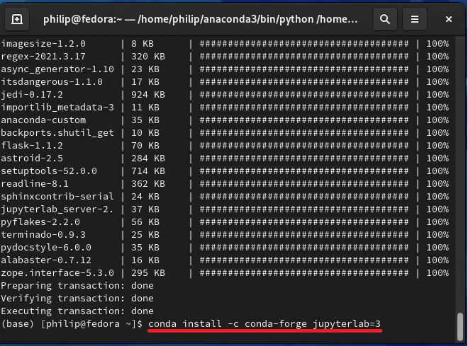

Once again type in 

```y```

to update to the latest version.


It is recommended to periodically look for updates to Anaconda and JupyterLab using the commands above.

Once updated a new prompt will display.

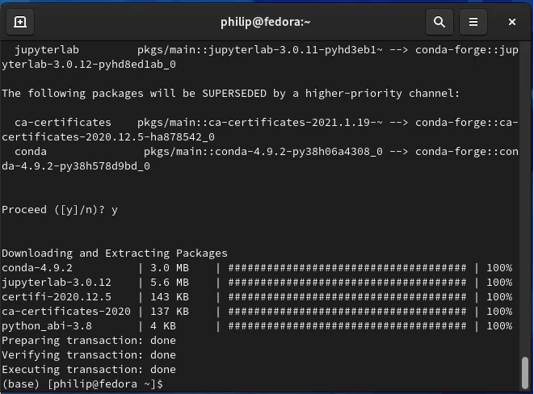

# Launching JupyterLab

Unlike on Windows no shortcuts for Anaconda are displayed on the Start Menu. The Anaconda Navigator can be launched from the terminal by typing in:

```anaconda-navigator```

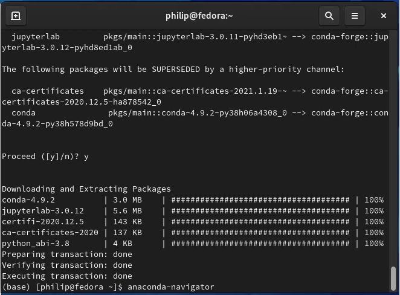

The Anaconda navigator shows a number of tiles corresponding to Python IDEs. JupyterLab can be launched:

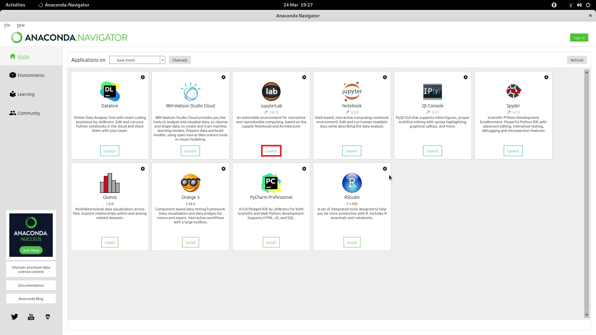

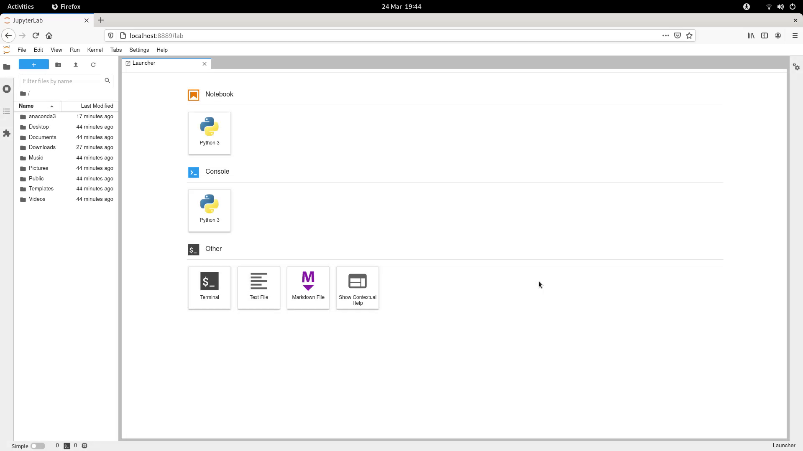

Alternatively JupyterLab can be launched directly from the terminal using:

```jupyter lab```

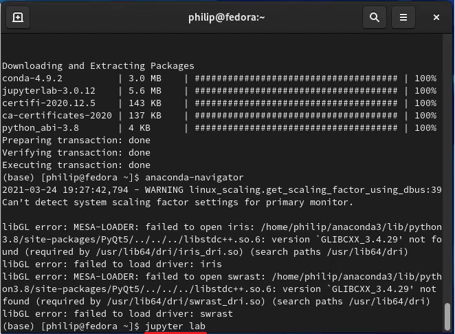

To the left hand side is the file explorer. A new launcher can be selected by pressing the ```+``` at the top left. From the new launcher (right hand side) a new Text File, Markdown File or Notebook can be selected.

# Getting Started with JupyterLab

For details about the Markdown file see:

[Markdown File Basics](https://github.com/PhilipYip1988/0-markdown-files/blob/main/markdown.md)

To get started with Python programming see:

[Getting Started with Python Programming](https://nbviewer.jupyter.org/github/PhilipYip1988/1-object-orientated-programming/blob/main/objectorientatedprogramming.ipynb)